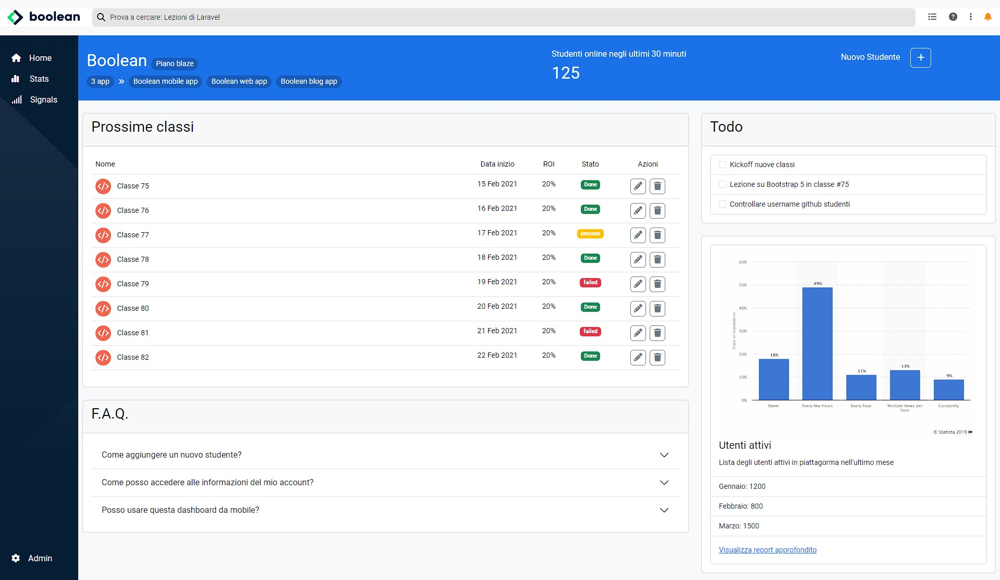

# Ho bootstrappato una dashboard 🤓



## Svolgimento

Con questo esercizio della durata di 2 giorni, abbiamo concluso il nostro percorso con **bootstrap**. Ho da prima iniziato ad impostare l'header nella sua struttura e nella responsività. Di seguito sono passato alla nav laterale e infine ho ultimato il progetto con _componenti bootstrap_ inserendoli nella dashboard.

## Linguaggi utilizzati

- HTML
- CSS
- JS (incluso nei componenti bootstrap per permettere il loro funzionamento)

## Note

E' stato interessante vedere come bootstrap ha reso possibile la funzionalità responsive alle tabelle tramite le proprie classi personalizzate. Di seguito una porzione di codice che fa capire quanto è facile personalizzare le tabelle con effetti visivi (in questo caso `:hover`)

```html
 <table class="table table-hover">

  <!-- Intestazioni della tabella -->
  <thead>
      <tr>
          <th scope="col" class="nome fw-normal">Nome</th>
          <th scope="col"
              class="data fw-normal text-center d-none d-md-table-cell">
              Data inizio
          </th>
          <th scope="col" class="fw-normal text-center d-none d-sm-table-cell">
              ROI
          </th>
          <th scope="col" class="fw-normal text-center">Stato
          </th>
          <th scope="col" class="fw-normal text-center">Azioni</th>

      </tr>
  </thead>
  <!-- /Intestazioni della tabella -->
```
<hr>